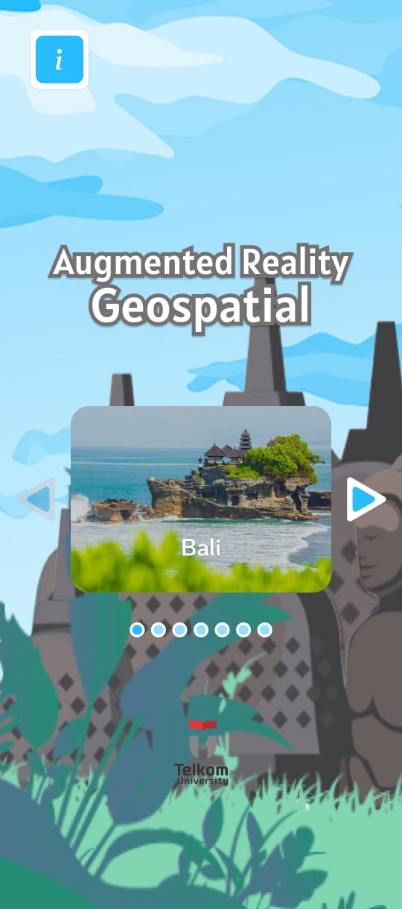

# OUTDOOR AR BERSKALA BESAR PADA TEMPAT WISATA

Sesuai judul PA ini yaitu Outdoor AR Berskala Besar Pada Tempat Wisata, aplikasi ini dibuat untuk menampilkan sebuah AR dengan objek 3D berskala besar didalam nya pada tempat wisata dengan target pengguna android. untuk pemilihan tempat wisata, kami mengambil beberapa tempat yang menjadi destinasi super prioritas Indonesia (https://info5dsp.kemenparekraf.go.id/)
yang diantara nya adalah Candi Borobudur, Danau Toba, Labuan Bajo, Mandalika, dan juga Likupang. Kami juga menambahkan Bali dan Bandung sebagai konten didalam AR yang akan dibuat. Aplikasi ini juga memakai beberapa software/perangkat lunak yaitu Geospatial Creator, Adobe Aero, dan blender

Tampilan Menu                         | Tampilan 1                             | Tampilan 2
--------------------------------------------|--------------------------------------------|--------------------------------------------
||

### Link Berkas PA

https://bit.ly/kelengkapanPa

### Susunan Tim

Nama            | Username Github | Posisi
----------------|-----------------|-----------
Adam Erlangga | AdamErlangga009    | Mahasiswa
Ihtada Lutfi Ramadani | ihtadalutfi    | Mahasiswa
Nama Pembimbing | usernamePbb     | Pembimbing
Nama Reviewer   | usernameRev     | Reviewer
